# Meteor Javascript Framework


## Inhoud
- [Waarom?](#waarom)
- [Wat heb ik gezocht?](#wat-heb-ik-gezocht)
   - [Installatie voor Windows](#installatie-voor-windows)
   - [Installatie voor Mac](#installatie-voor-mac)
 - [Guide](#guide)
 - [Simple ToDo List](#simple-todo-list)
   - [Database](#database)
   - [Forms](#forms)
   - [ReactiveDict](#reactivedict)
   - [Account](#account)
   - [Security](#security)
   - [Publish & Subscribe](#publish--subscribe)
- [Findings](#findings)
- [Extra Resources](#extra-resources)
- [Logboek](#logboek)

<br>

## Waarom?
Ik was op zoek naar Javascript frameworks en keek naar wat populair was. Ik wilde eigenlijk met Vue beginnen, maar aangezien dit al een veel gekozen onderwerp is en het op stage op bod kan komen, ben ik overgestapt naar Meteor.

<br>

## Wat heb ik gezocht?
Ik ben via google bij de [officiële site](https://www.meteor.com/install) van meteor begonnen voor de installatie ervan.

#### Installatie voor windows:
- Eerst [Chocolaty](https://chocolatey.org/install) installeren
 - In cmd:
 ```cmd
 @"%SystemRoot%\System32\WindowsPowerShell\v1.0\powershell.exe" -NoProfile -InputFormat None -ExecutionPolicy Bypass -Command "iex ((New-Object System.Net.WebClient).DownloadString('https://chocolatey.org/install.ps1'))" && SET "PATH=%PATH%;%ALLUSERSPROFILE%\chocolatey\bin"
 ```
- Daarna in cmd: `choco install meteor`
- Er komt een vraag in de CLI of het script mag runnen, antwoord `y`
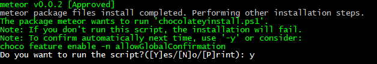<br>


#### Installatie voor Mac:
- In cmd: `curl https://install.meteor.com/ | sh`


Tijdens de installatie bleek de extracting stap super lang te duren. [Zie issue #7688](https://github.com/meteor/meteor/issues/7688)<br>

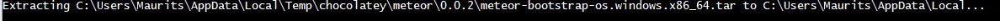
Eerst heb ik naar mijn PATH variabelen gekeken zoals in de de comments van deze link staat. Daarna heb ik tijdelijk tar.exe in system32 gerenamed (gevonden via `where tar`), omdat Meteor hier ook mee werkt een conflicten kon geven. Uiteindelijk blijkt het deactiveren van windows firewall de oplossing te zijn, samen met heel veel gedueld. De installatie is traag alsook nieuwe apps maken.
Met de firewall disabled schijnt er ook betere performance te zijn volgens meteor zelf.
Als alles goed is krijg je het volgende te zien:<br>

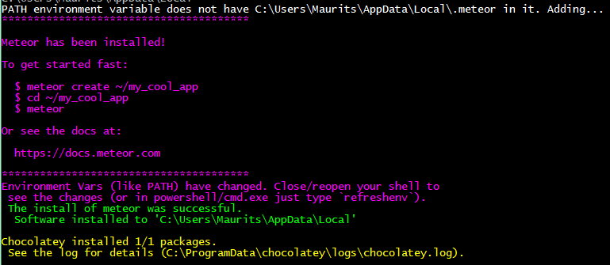

Als je een Meteor project cloned, vergeet dan niet om een `meteor npm install` te doen! Npm hoeft niet apart geïnstalleerd te zijn doordat dit in Meteor zit.

<br>

## Guide
Na de installatie ben ik naar een guide gaan zoeken voor meteor. [Dit](https://www.meteor.com/tutorials/blaze/creating-an-app) is de officiële tutorial van meteor zelf.

Op een app te maken typen we in cmd `meteor create MyApp`, daarna ga je in de map MyApp en type je `meteor` om de app de starten op je localhost:3000.


### Simple ToDo List
We hebben de app gemaakt zoals hierboven beschreven en gaan het nu verder uitwerken zoals de tutorial. Die main app zit in de client folder. We passen de HTML en JS aan en maken een imports folder waarin we UI, API en startup aanmaken. Elke folder die imports heet wordt niet geladen en files moeten geïmporteerd worden door het gebruik van `import`. Voor meer informatie over mappenstructuur (zoals client en server) check [deze site](https://guide.meteor.com/structure.html#special-directories).

De HTML in Meteor heeft naast body en head tags ook de `<template>` tag, alles in deze tag wordt gecompileerd naar Meteor templates waar na je kan verwijzen in HTML met `{{> templateName}}` of in JS met `Template.templateName`. Verder werkt Meteor met 'spacebars' packge voor het compilen. Check de Extra Resources voor meer informatie hierover. Dit gebruiken we ook in onze body.html in de import folder.<br>

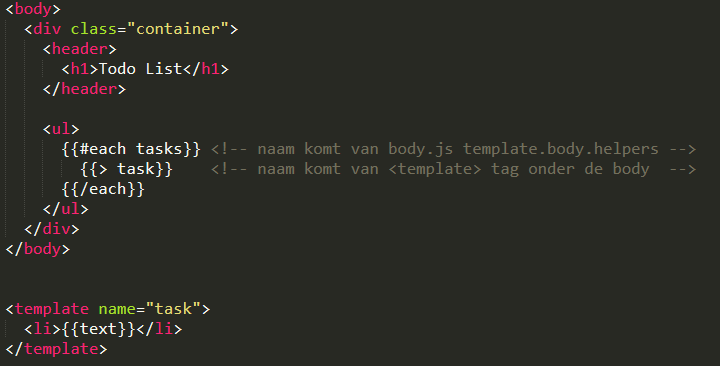<br><br>


#### Database
We gaan nu een collectie van taken aanmaken en die laten importeren door de server. Een collectie is heel gemakkelijk aangemaakt via
`import { Mongo } from 'meteor/mongo';
export const Tasks = new Mongo.Collection('tasks');`
Dit plaatsen we in een nieuwe API folder.
We kunnen onze database via de CLI gebruiken door `meteor mongo` te typen en daarin een task in te geven zoals bijvoorbeeld: `db.tasks.insert({ text: "Hello world!", createdAt: new Date() });`.

<br>

#### Forms
Dit moet natuurlijk ook via de app zelf kunnen, dus we voegen een form toe aan onze body.html en passen onze body.js aan voor de submit van de form.<br>

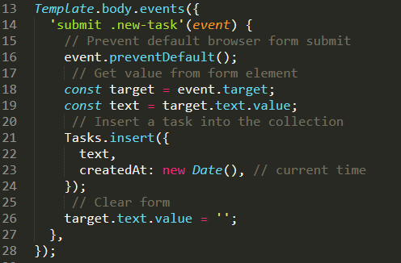<br>


De JS wacht hier op een submit event met de class `new-task`, haalt de value uit de form op en entered het in de Tasks collection (api/tasks.js)

Voor het checken en deleten van tasks maken we twee nieuwe files aan, task.html en task.js. Je kan deze importeren in main.js `import '../imports/ui/task.js';` Ook moet je in de task.js geen template importeren zoals de tutorial aangeeft, want dit gebeurd al in body.js
De app ziet er nu als volgt uit:<br>

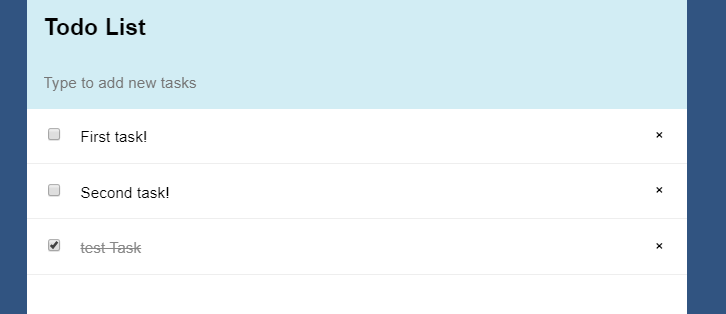<br><br>


#### ReactiveDict
Alle tasks worden automatisch bijgewerkt als we onze collectie aanpassen. Dit is doordat Meteor weet wanneer data in Mongo.Collection wordt aangepast. ReactiveDict is op dezelfde manier, maar synced niet met de server waardoor het alleen geschikt is voor tijdelijke UI changes zoals filters. Op deze manier kan je bijvoorbeeld tijdelijk tasks die al klaar zijn niet laten zien. 
ReactiveDict voeg je toe door in de CLI `meteor add reactive-dict` te typen. Vervolgens maak je een nieuwe ReactiveDict waar de status van een variabele zal worden opgeslagen, in dit geval de status van de checkbox. Met andere woorden of de filter aan staat of niet.
Daarna wordt er in de body.helper gechecked of de filter aanstaat, zo ja dan zal alles behalve de gecheckte boxes gereturned worden.<br>

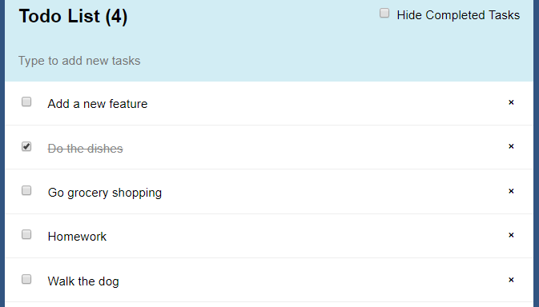<br>

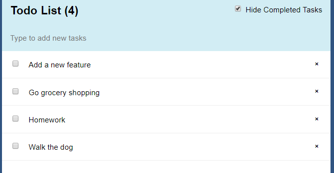<br><br>


#### Accounts
Meteor heeft ook packages om makkelijk accounts te kunnen creëren. In de app directory voegen we volgende packages toe: `meteor add accounts-ui accounts-password`. Door `{{> loginButtons}}` toe the voegen in the body.html en `import '../imports/startup/accounts-config.js';` in main.js heb al een login aangemaakt. Dit heeft op dit moment nog geen functie, maar is al super snel gedaan. Zo kan je bijvoorbeeld per task zien van welke account die is.<br>

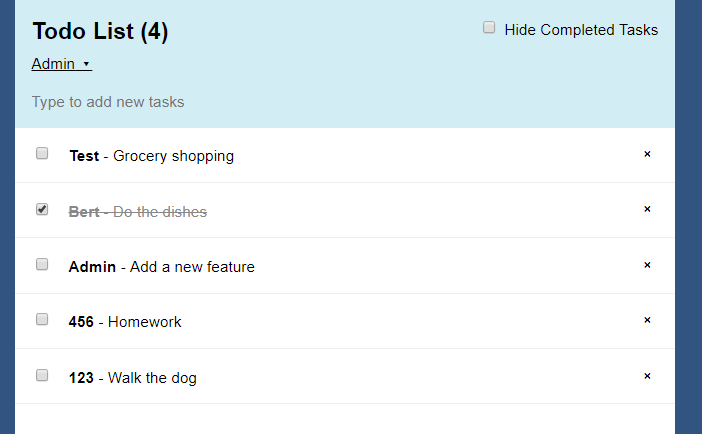<br><br>


Op deze manier kan je bijvoorbeeld ook content enkel voor het juiste account laten zien. 
In body.js geven we met de insert mee welke userId de task heeft aangemaakt:

```Javascript
Tasks.insert({
  text,
  createdAt: new Date(), // current time
  owner: Meteor.userId(),
  username: Meteor.user().username,
});
```

In task.js voegen we een helper toe om te checken of de owner van de task dezelfde user is als de ingelogde user:

```Javascript
Template.task.helpers({
  isOwner: function(){
    return this.owner === Meteor.userId();
  },
});
```

En onze template in task.html krijgt een if-statement:

```HTML
<template name="task">
  {{#if isOwner}}
    <li class="{{#if checked}}checked{{/if}}">
      <button class="delete">&times;</button>

      <input type="checkbox" checked="{{checked}}" class="toggle-checked" />

      <span class="text">{{text}}</span>
    </li>
  {{/if}}
</template>
```

([Zie youtube tutorial](https://www.youtube.com/watch?v=v9n9jkwunzU&list=PLLnpHn493BHECNl9I8gwos-hEfFrer7TV&index=19))
<br><br>
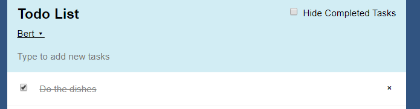<br>
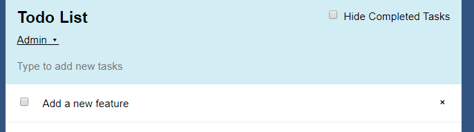<br><br>


#### Security
Standaard heeft elke nieuwe Meteor App een package genaamd insecure. Hiermee kan je makkelijk de database aanpassen, wat super handig is tijdens development, maar dit mag absoluut niet als het live gaat. We moeten deze package dus verwijderen en onze app aanpassen zodat het nog werkt:
`meteor remove insecure`

In de api/tasks.js moeten we dus methods gaan aanmaken en de body.js en task.js updaten.

*api/tasks.js*
```Javascript
import { Meteor } from 'meteor/meteor';
import { Mongo } from 'meteor/mongo';
import { check } from 'meteor/check';
 
export const Tasks = new Mongo.Collection('tasks');
 
Meteor.methods({
  'tasks.insert'(text) {
    check(text, String);
 
    // Make sure the user is logged in before inserting a task
    if (! Meteor.userId()) {
      throw new Meteor.Error('not-authorized');
    }
 
    Tasks.insert({
      text,
      createdAt: new Date(),
      owner: Meteor.userId(),
      username: Meteor.user().username,
    });
  },
  'tasks.remove'(taskId) {
    check(taskId, String);
 
    Tasks.remove(taskId);
  },
  'tasks.setChecked'(taskId, setChecked) {
    check(taskId, String);
    check(setChecked, Boolean);
 
    Tasks.update(taskId, { $set: { checked: setChecked } });
  },
});
```

*ui/body.js*
```javascript
// Insert a task into the collection
Meteor.call('tasks.insert', text);
```

*ui/task.js*
```javascript
Template.task.events({
  'click .toggle-checked'() {
    // Set the checked property to the opposite of its current value
    Meteor.call('tasks.setChecked', this._id, !this.checked);
  },
  'click .delete'() {
    Meteor.call('tasks.remove', this._id);
  },
});
```


*Optimistic UI*

We definiëren de metods op zowel de client als server side zodat er een *optimistic ui* bestaat. 
Dit gebeurd doordat er twee dingen tegelijk gebeuren op het moment dat een Meteor.call gebeurd, namelijk
 - een request wordt naar de server gestuurd
 - de client runt ook een simulatie in de tussentijd

Dit betekend dat een nieuwe task al zal verschijnen voordat de server een antwoord geeft. Als het antwoord van de server overeenkomt met wat de client heeft gegenereerd, veranderd er niks en lijkt het gewoon sneller. Als het antwoord wel verschilt, zal de UI aangepast worden naar het antwoord van de server.


#### Publish & subscribe
[Zie Meteor Docs](https://guide.meteor.com/data-loading.html)<br>
Net zoals de package insecure is er nog een die er standaard is voor development, namelijk autopublish. Ook deze moeten we verwijderen voordat de app live gaat: `meteor remove autopublish`.
Door deze te verwijderen kan de client geen Task.find() meer doen. Dit heeft als gevolg dat de data niet meer zo maar opgevraagd kan worden door elke gebruiker, dus het niet misbruikt zo kunnen worden om gevoelige informatie te verkrijgen.
Het andere gevolg is, is dat onze app niet meer werkt en dit moeten oplossen d.m.v. Meteor.publish en Meteor.subscribe.

In api/tasks.js doen we het volgende:
```Javascript
if (Meteor.isServer) {
  // This code only runs on the server
  Meteor.publish('tasks', function tasksPublication() {
    return Tasks.find();
  });
}
```

In ui/body.js doen het volgende:
```Javascript
Template.body.onCreated(function bodyOnCreated() {
 	this.state = new ReactiveDict();
 	//This is where we'll store the new checkbox state when its created
 	Meteor.subscribe('tasks');
});
```

De Tasks.find() wordt nu dus op de server uitgevoerd, en er wordt dan op gesubscribed. Hierdoor kan je met private en public data werken, bijvoorbeeld door het volgende te doen:

```Javascript
if (Meteor.isServer) {
  // This code only runs on the server
  // Only publish tasks that belong to the current user
  Meteor.publish('tasks', function tasksPublication() {
    return Tasks.find({
      $or: [
        { owner: this.userId },
      ],
    });
  });
}
```

<br><br>

## Getest
Verder heb ik [deze WhatsApp Clone](https://angular-meteor.com/tutorials/whatsapp/meteor/bootstrapping) gevolgt (niet zelf gemaakt). Per stap heb ik de code gedownload, uitgeprobeerd en proberen te begrijpen. De meeste stappen snapte ik wel, maar om het zelf te maken is op het moment nog moeilijk. Helaas veel errors tegen gekomen vanaf stap vier, zonder ze te kunnen oplossen. Zie [logboek](#logboek) 2 november.<br>

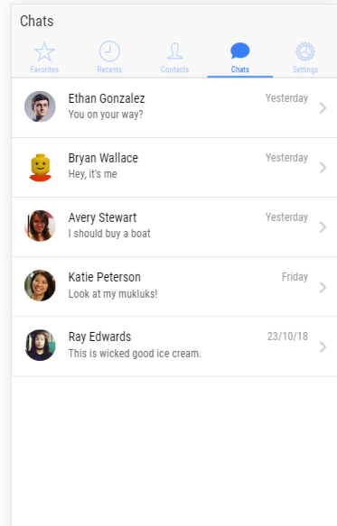
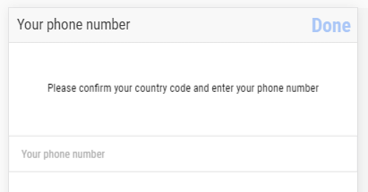<br>
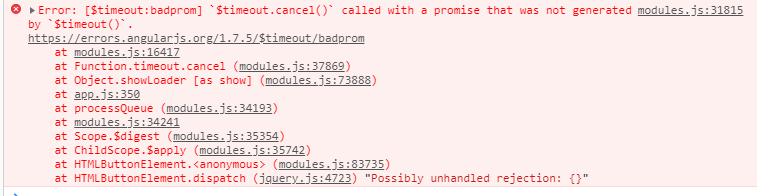

<br><br>


## Findings
- Interessant is dat er nog meerdere mogelijkheden zijn om je app te beginnen.
  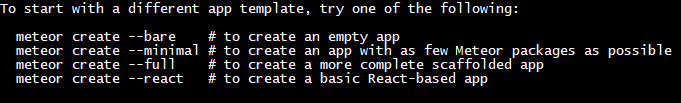

- NPM hoeft niet geïnstalleerd te zijn ookal gebruikt Meteor dit wel. Dit komt doordat het in Meteor zelf zit. Je kan dus `meteor npm install` doen. Zie ook [deze link](https://guide.meteor.com/using-npm-packages.html#installing-npm) voor informatie rond --save, -dev en --production

- Je kan de app runnen in een IOS of Android emulator d.m.v. `meteor add-platform ios` of `meteor add-platform android`.

- De pure JS implentatie van bcrypt (login) werkt, maar is veel langzamer.<br>
  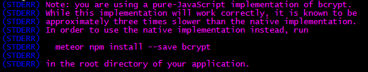<br>
Dit resulteerde wel in [deze error](https://forums.meteor.com/t/bcrypt-warnings-in-console-following-instructions-crashes-app/44889), maar met een simpele restart was dit gefixed.

- Super makkelijk om grote platforms te intergreren om in te loggen, zie [deze link](https://guide.meteor.com/accounts.html#oauth)


<br><br>

## Extra Resources
- Official Meteor Docs
  - https://docs.meteor.com/
- Repository of packages for Meteor
  - https://atmospherejs.com/
- Organized list of Meteor Packages
  - https://github.com/Urigo/awesome-meteor
- Meteor Spacebar Compiler Docs
  - http://blazejs.org/api/spacebars.html
- Meteor ReactiveDict Packages
  - https://atmospherejs.com/meteor/reactive-dict
- Youtube Series on Meteor
  - https://www.youtube.com/watch?v=4l4pG0a25qs&index=2&list=PLLnpHn493BHFYZUSK62aVycgcAouqBt7V
- Meteor Account Documentation
  - https://docs.meteor.com/api/accounts.html
- MongoDB Docs
  - https://docs.mongodb.com/v3.2/reference/
- Mongol Meteor devtools
  - https://github.com/msavin/Mongol-meteor-devtools
- Meteor Development Tools
  - http://meteor.toys/
- WhatsApp Clone
  - https://angular-meteor.com/tutorials/whatsapp/meteor/bootstrapping

- Direct download for Meteor installation package
  - https://packages.meteor.com/bootstrap-link?arch=os.windows.x86_64
- Check PATH variable on windows
  - https://www.computerhope.com/issues/ch000549.htm
- Meteor onLogin event
  - https://stackoverflow.com/questions/16350424/meteor-js-on-login-event
- If statements in Handlebars
  - https://stackoverflow.com/questions/15252754/if-statements-in-handlebars
- Meteor $timeout.cancel() error
  - https://github.com/Urigo/Ionic-MeteorCLI-WhatsApp/issues/60


<br>


## Logboek
**5 okt 2018**
 - Installatie Meteor
 - Gezocht naar verschillende tutorials, uiteindelijk gekozen voor bovenstaande
 - Findings
 - Extra Resources

**9 okt 2018**
 - Database, Forms en ReactiveDict
 - Extra Resources

**15 okt 2018**
 - Account, lang geprobeerd om tasks per account te laten zien wat achteraf best wel simpel opgelost was.
 - Security
 - Findings
 - Extra Resources

**23 okt 2018**
 - Publish & Subscribe
 - Getest (whatsapp clone)
 - Extra Resources

**26 okt 2018**
 - Getest (whatsapp clone), veel errors

**2 nov 2018**
 - Getest (whatsapp clone), proberen om errors op te lossen. Iemand anders heeft precies hetzelfde probleem gisteren op [github](https://github.com/Urigo/Ionic-MeteorCLI-WhatsApp/issues/60) gepost. Ik heb nog geen succes tot nu toe helaas.
 - Extra Resources

**5 / 6 nov 2018**
 - Omzetten naar .md en uploaden naar git